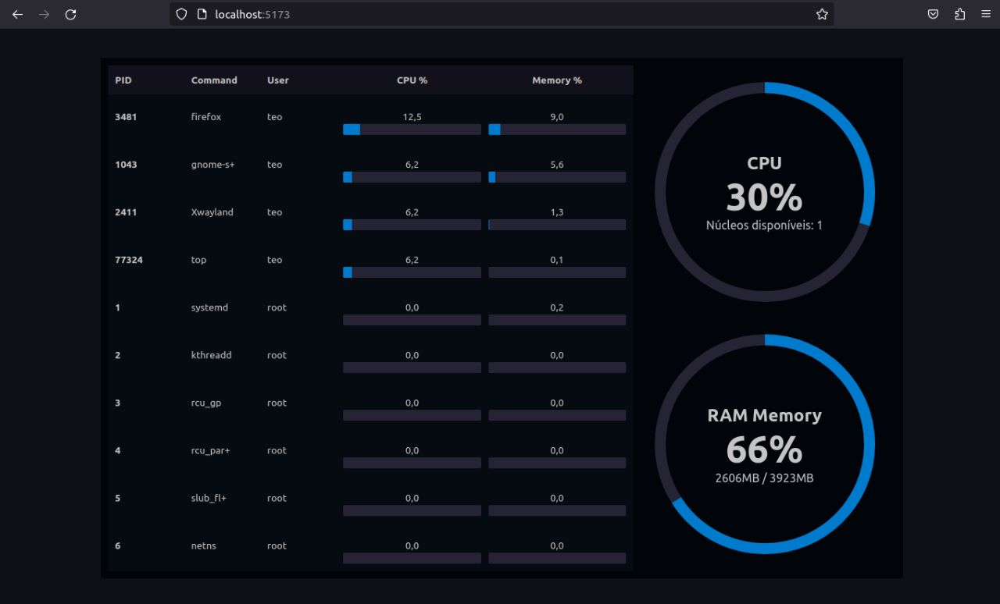

# OS-Dashboard



> Dashboard created to Operational System class at UTFPR - Curitiba.<br>
> This homework objective is observe system processes, CPU and RAM Memory.

### Operacional System:
* Ubuntu 22.04.2

### Technologies:
* NodeJS

### Versions:
* node v18.5.0
* npm v8.12.1

> You can try run with another versions, but it's not granted that will work.

### Main libraries used:
* Express
* ShellJS
* ReactJS
* Axios

## You need to run frontEnd and restAPI.
### Running restAPI:
```    
cd restAPI
npm install
node index.js
```
> restAPI listen to port 3000.<br>
> Fell free to change it in the restAPI/<a href="restAPI/index.js">index.js</a> file.<br>
> If you changed the port, you'll also need to change inside the frontEnt, in the frontEnd/<a href="frontEnd/src/App.jsx">App.jsx</a> file.
### Running frontEnd:
```
cd frontEnd
npm install
npm run dev
```
> frontEnd uses port 5173 to run.<br>
> Access localhost:5173.<br>
> The terminal will show you the url.
